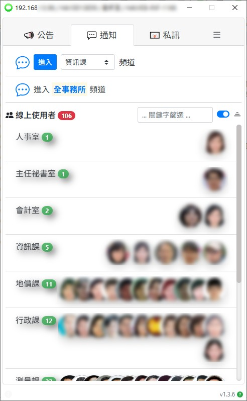

<div class="d-flex"></div>

## Dev Usage

```bash
# copy the source
$ git clone git@github.com:pyliu/lah-messenger.git

# install dependencies
$ cd lah-messenger
$ yarn (or `npm install`)

# development mode
$ yarn dev (or `npm run dev`)

# production build
$ yarn build (or `npm run build`)
```
